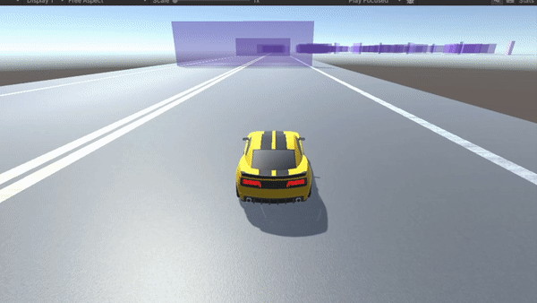

# Unity Project: Reinforcement Learning on Circuit de Barcelona-Catalunya

This project showcases a car agent that has been trained using reinforcement learning to complete successful laps on a scaled-down version of the Circuit de Barcelona-Catalunya. We've used the `mlagents` package from Unity for the agent's training.


## Requirements:

- Unity (2022.3.9f1)
- [mlagents](https://github.com/Unity-Technologies/ml-agents) package installed

## Getting Started:

### 1. Clone the Repository:

Ensure that you've cloned this repository to your local machine.

### 2. Navigate to the Build Folder:

Open a terminal or command prompt and navigate to the `Build` folder of the cloned project.

### 3. Train the Model:

To train the model yourself, run the following command:  


```bash
mlagents-learn config.yaml --run-id=<YOUR_DESIRED_NAME>
```

## Experience the Trained Model:

A pre-trained model is included in the project. To see the car agent in action:

1. Open the project in Unity.
2. Play the environment from the Unity interface.

---

Enjoy the simulation and feel free to contribute or suggest improvements!
